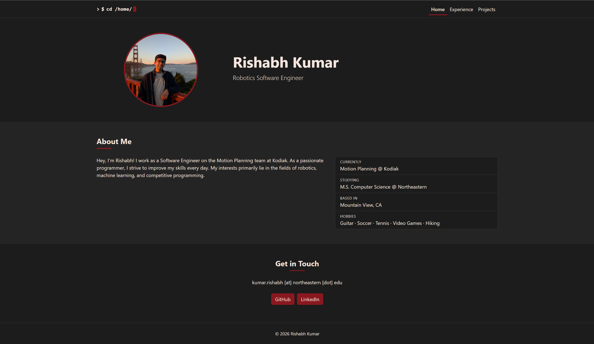
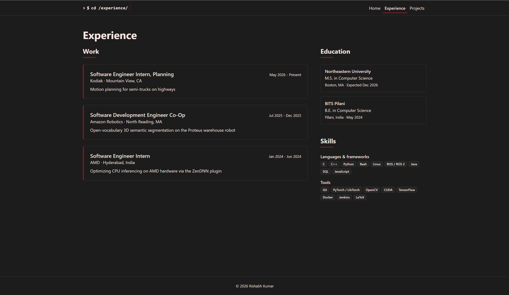
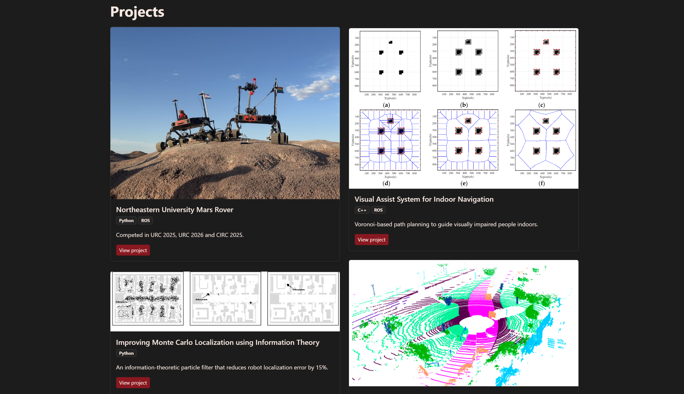

# My Personal Homepage

A personal portfolio site showcasing my experience, skills, and
robotics projects. Its signature feature is a terminal-style navigation bar:
each time a page loads, the logo types out a `cd` command for that page (e.g.
`cd /projects/`) behind a blinking cursor.

- **Live site:** https://k-rishabh.github.io
- **Author:** Rishabh Kumar
- **Class:** [CS5610 Web Development, Northeastern University (Fall 2026)](https://johnguerra.co/classes/webDevelopment_online_fall_2026/)
- **Video demo:** [link](https://drive.google.com/file/d/1Y35glH1dwYvLGI41gjYny8gkXgfYyWeL/view?usp=sharing)
- **Slides:** [link](https://docs.google.com/presentation/d/1fCW3stIQaOvB6LXOEcKj0Ifyzz4qr_yQWdNIhu_lnuM/edit?usp=sharing)
- **Design document:** [docs/design-document.md](docs/design-document.md)

## Objective

Build a personal homepage that presents who I am and what I have worked on,
using standards-compliant HTML, CSS, vanilla JavaScript (ES6 modules) and
Bootstrap 5, deployed on GitHub Pages.

## Screenshots

### Home



### Experience



### Projects



## Pages

| Page                                | Description                                |
| ----------------------------------- | ------------------------------------------ |
| [Home](index.html)                  | Intro, about me, hobbies and contact links |
| [Experience](experience.html)       | Work experience, education, and skills     |
| [Projects](projects.html) (AI page) | Project gallery rendered from data         |

## Requirements

- HTML5, CSS3 and vanilla JavaScript (ES6 modules)
- [Bootstrap 5.3](https://getbootstrap.com/) (loaded from the jsDelivr CDN)
- No build step or frameworks; Node.js is only needed for the optional lint and
  format scripts
- Any modern browser

## How to run locally

ES modules do not load from `file://` URLs, so serve the folder over HTTP:

```bash
git clone https://github.com/k-rishabh/k-rishabh.github.io.git
cd k-rishabh.github.io
python -m http.server 8000
```

Then open http://localhost:8000. Any static file server (for example the VS Code
Live Server extension) also works.

### Linting and formatting (optional, requires Node.js)

```bash
npm install
npm run lint          # ESLint
npm run format:check  # Prettier
```

## Project structure

```
index.html, experience.html, projects.html
css/style.css          Custom styles on top of Bootstrap
js/main.js             Entry module
js/terminalNav.js      Terminal-style navigation (original feature)
js/projects.js         Projects gallery
js/data/projects.js    Project data
img/                   Images and favicon
docs/                  Design document, wireframes and screenshots
package.json           Project metadata and dependencies
eslint.config.js       ESLint configuration (class config)
.prettierrc            Prettier options (match the class ESLint config)
```

## Use of generative AI

- **Tool / model:** Claude Code (CLI) running Claude Opus 5.5 (`claude-opus-5-5`), September 2026.
- **How it was used:**
  - Brainstorming for design ideas and theme for the website
  - Applying color themes given hex codes and making different parts of the website color coordinated
  - Generating the "Projects" page on the website, with the idea of having asynchronous columns
- **Example Prompts:**
  - Analyze the code already existing in the repository as well as the project requirements and generate a page that displays my projects. The page must have two columns that are asynchronous, and the box size depends on the size of the image.
  - Can you color coordinate the website given the hex codes: background (#1C1C1C), text (#F5E6DF), accent (#891820)?

## License

[MIT](LICENSE) © 2026 Rishabh Kumar
