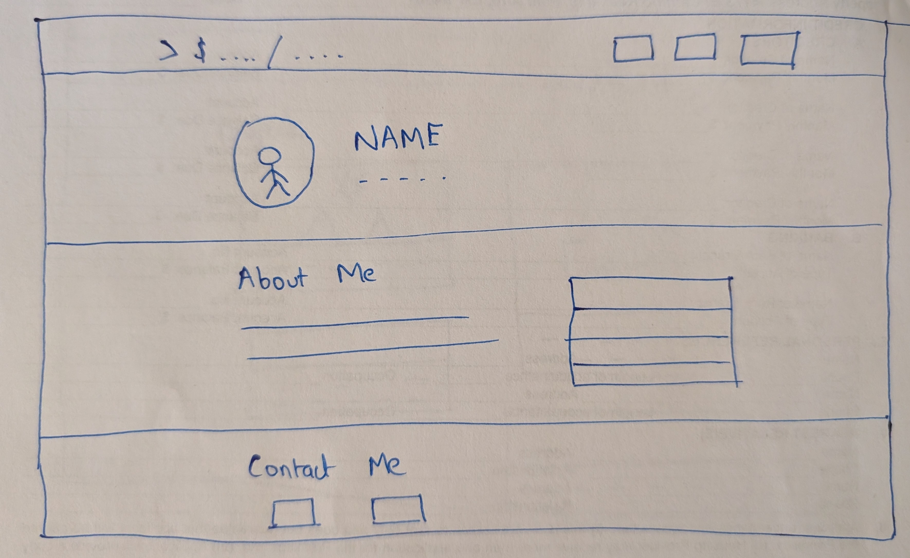
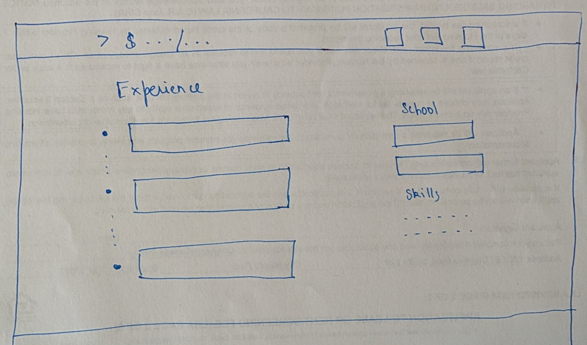
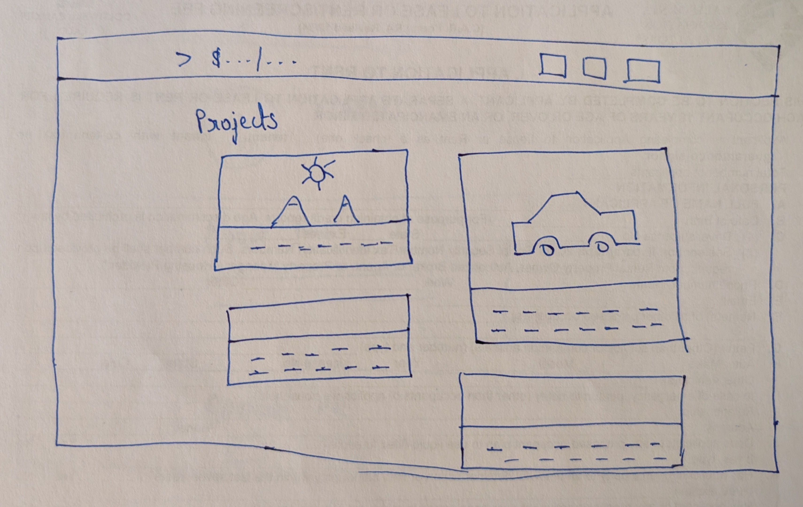

# Design Document — Rishabh Kumar Personal Homepage

## Project description

A personal homepage and portfolio for Rishabh Kumar, an MS Computer Science
student at Northeastern University working on robotics software (motion
planning, perception and localization). The site introduces who I am, lists my
work experience, education, skills, and showcases my projects.

It has three pages:

1. **Home:** introduction, short bio, quick facts (including hobbies) and
   contact links.
2. **Experience:** a card for each job, education, and skills.
3. **Projects:** (AI-generated page) a gallery of project cards, each with its
   technologies, a one-line description and a link to the project.

**What makes it different:** the navbar logo is a terminal prompt
(`> $ cd /home/`) with a blinking cursor. It types the current page's path on
load (e.g. `cd /projects/`), as if the visitor had just moved there in a shell.

## User personas

### Priya, Technical Recruiter

- Screens dozens of candidates a day for robotics and autonomy roles.
- Has about two minutes per candidate and mostly browses on a laptop.
- **Goals:** quickly confirm current role, education, graduation date and key
  skills; find a way to get in touch.
- **Frustrations:** portfolios that bury basic information or don't work on
  mobile.

### Dr. Chen, Hiring Manager

- Leads a planning or perception team at a robotics company.
- **Goals:** understand the depth of a candidate's technical work, including
  which algorithms, which languages, and measurable results.
- **Frustrations:** vague project descriptions with no concrete outcomes.

### Alex, Classmate

- A fellow Northeastern student looking for teammates for a robotics project or
  competition.
- **Goals:** see which technologies I know and what I've built before.

## User stories

1. As **Priya**, I want to see my current role and school on the home page so that I can decide within seconds if the candidate fits the
   opening.
2. As **Priya**, I want a clear contact section with GitHub and
   LinkedIn so that I can reach out right away.
3. As **Dr. Chen**, I want each job to show the title, company, dates and a
   one-line summary so that I can scan the candidate's background quickly.
4. As **Dr. Chen**, I want each project to show the technologies it used (e.g.
   ROS, C++) so that I can quickly find work relevant to my team.
5. As **Alex**, I want to see a list of skills so that I know if
   we'd work well together on a project.
6. As any visitor, I want the site to work well on my phone so that it's
   comfortable to read anywhere.

## Wireframes

### Home

### Experience

### Projects

